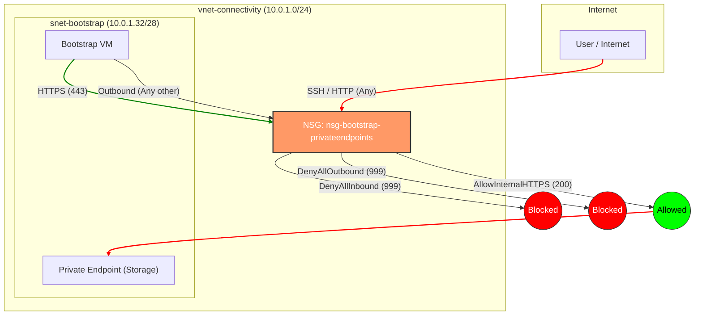

# Bootstrap Bicep Scripts Documentation

This directory contains the Bicep scripts required to initialize the "bootstrap" environment for deploying Azure Landing Zones.

The primary objective of these scripts is to configure an existing subscription with the fundamental resources needed to host the Terraform state (backend) and a jumpbox virtual machine for operations.

## File Structure

### `main.bicep`

This is the main entry point for the deployment. It orchestrates calls to the various modules to configure the infrastructure.

**Main Parameters:**
- `managementGroupName`: The target management group where the existing subscription is located.
- `existingSubscriptionId`: The ID of the subscription where resources will be deployed.
- `location`: The Azure region (e.g., `uksouth`) where the resources will be deployed.
- `adminUsername` / `adminPublicKey`: Credentials for the Linux VM.

**Deployed Resources (via modules):**
1. **Subscription Vending**: Network and identity configuration.
2. **DNS Zones**: Private DNS zones for Private Links (e.g. Private Endpoints).
3. **Resource Groups**: Creation of resource groups (e.g. `rg-devops-uks-001`).
4. **Storage**: Storage account for the Terraform state.
5. **Virtual Machine**: Administration VM and Bastion.

---

### Modules

#### 1. `modules/lz-vending.bicep`
Uses the AVM (Azure Verified Modules) `sub-vending` module to:
- Configure virtual networks (`vnet-connectivity-*`).
- Define subnets, specifically `snet-bootstrap-privateendpoints`.
- Configure the Network Security Group (NSG) `nsg-bootstrap-privateendpoints`.
- Create a User Assigned Identity with "Owner" rights on the subscription (for bootstrap operations).

#### 2. `modules/dns-zones.bicep`
Uses the AVM `private-link-private-dns-zones` module.
- Deploys necessary private DNS zones for Azure services (Private Link).
- Links these zones to the created virtual networks.

#### 3. `modules/resourcegroups.bicep`
- Creates the resource group for DevOps tools and storage (e.g., `rg-devops-uks-001`).

#### 4. `modules/storage.bicep`
Uses the AVM `storage-account` module.
- Creates a secure storage account (public access disabled).
- Configures a Private Endpoint for secure access via the private network.
- Creates a `state` container to store Terraform state files (.tfstate).
- Assigns the `Storage Blob Data Contributor` role to the deploying user.

#### 5. `modules/virtualmachine.bicep`
Uses the AVM `virtual-machine` and `bastion-host` modules.
- **VM**: Deploys an Ubuntu VM (Standard_D2s_v3) serving as a "Jumpbox". It has a public IP (security note: access is restricted by NSG/SSH key).
- **Bastion**: Deploys an Azure Bastion service (Developer SKU) for secure access to the VM without exposing SSH ports directly to the internet.

---

## Network Security Rules

The subnet `snet-bootstrap-privateendpoints` (10.0.1.32/28) hosting the VM and Private Endpoints is protected by a strict Network Security Group (`nsg-bootstrap-privateendpoints`).

### Applied Rules:
- **Inbound**:
  - **AllowInternalHTTPSCommunication (Priority 200)**: Allows HTTPS (TCP 443) traffic *only* if the source is within the subnet (`10.0.1.32/28`). This enables intra-subnet communication (e.g., VM to Private Endpoint).
  - **DenyAllInbound (Priority 999)**: explicitly denies all other inbound traffic.
- **Outbound**:
  - **DenyAllOutbound (Priority 999)**: explicitly denies all outbound traffic from the subnet.

### Traffic Flow Diagram



> **Note**: The current configuration is highly restrictive. The `DenyAllOutbound` rule effectively isolates resources in this subnet, preventing them from initiating connections to external destinations or other subnets. The `AllowInternalHTTPSCommunication` ensures the VM can access the Storage Account via Private Link within the same subnet.

## Prerequisites

- Azure CLI or PowerShell installed.
- Authenticated to Azure (`az login`).
- Permissions to create resources and assign roles on the target subscription.

## Deployment

To deploy this infrastructure, use the following command (example with Azure CLI):

```bash
az deployment mg create \
  --name "bootstrap-deployment" \
  --location "uksouth" \
  --management-group-id "YOUR_MG_ID" \
  --template-file ./main.bicep \
  --parameters existingSubscriptionId="YOUR_SUB_ID" \
               adminUsername="azureuser" \
               adminPublicKey="YOUR_SSH_PUBLIC_KEY"
```
